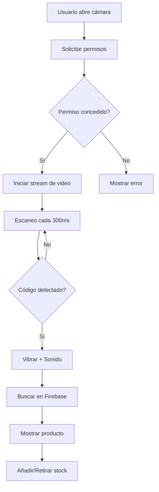

# 📸 Guía del Escáner de Códigos de Barras

## 🎯 Implementación

Este proyecto utiliza la **Barcode Detection API nativa** del navegador, sin dependencias externas pesadas.

## ✅ Compatibilidad de Navegadores

### ✅ Completamente Soportado
- **Chrome/Edge en Android** (versión 83+)
- **Chrome/Edge en Windows/Mac** (versión 88+ con flag habilitado)

### ⚠️ Soporte Limitado
- **Safari iOS**: NO soportado nativamente
- **Firefox**: NO soportado nativamente
- **Opera**: Soporte parcial

### 🔧 Cómo habilitar en Chrome Desktop

1. Abre `chrome://flags`
2. Busca "Experimental Web Platform features"
3. Activa el flag
4. Reinicia el navegador

## 📊 Formatos de Código Soportados

La aplicación está configurada para detectar los formatos más comunes en productos de bebidas:

### Formatos Principales
- **EAN-13** 🏦 - Estándar europeo (Coca-Cola, Aquarius, etc.)
- **EAN-8** - Versión corta para productos pequeños
- **UPC-A** 🇺🇸 - Estándar estadounidense
- **UPC-E** - Versión compacta de UPC
- **Code-128** - Códigos industriales y logística
- **QR Code** - Para productos nuevos con información adicional

### Ejemplos de Códigos Reales
```
Coca-Cola 2L:        8410052000010 (EAN-13)
Agua Font Vella:     8410199001234 (EAN-13)
Estrella Damm:       8410793000124 (EAN-13)
Red Bull:            9002490100070 (EAN-13)
Aquarius Limón:      8410052121970 (EAN-13)
```

## 🚀 Cómo Usar el Escáner

### Opción 1: Escáner de Cámara (Recomendado)

1. **Accede a la sección Escanear** (botón central del navbar)
2. **Haz clic en "Cámara"**
3. **Permite el acceso a la cámara** cuando el navegador lo solicite
4. **Coloca el código de barras dentro del marco**
5. **¡Listo!** El código se escaneará automáticamente

#### 💡 Consejos para un Buen Escaneo
- 💡 **Buena iluminación**: Evita sombras sobre el código
- 📱 **Distancia correcta**: 10-20cm del código
- 🎯 **Enfoque**: Espera a que el código esté nítido
- ➡️ **Orientación**: Mantén el código horizontal
- 🚨 **Sin movimiento**: Mantén el móvil estable

### Opción 2: Entrada Manual

1. Escribe el código de barras en el campo de texto
2. Pulsa Enter o haz clic en "Buscar"

### Opción 3: Subir Foto

1. Haz clic en el botón de imagen
2. Selecciona una foto que contenga un código de barras
3. El sistema lo detectará automáticamente

## 👨‍💻 Arquitectura del Código

### Archivos Principales

```
src/
├── hooks/
│   └── useBarcodeDetector.js   # Hook para Barcode Detection API
├── components/
│   ├── Scanner.jsx              # Componente principal del escáner
│   └── BarcodeCamera.jsx        # Componente de cámara
```

### `useBarcodeDetector.js`

Hook personalizado que:
- ✅ Detecta si el navegador soporta la API
- 📖 Obtiene formatos soportados
- 🔍 Crea una instancia del detector
- 📸 Proporciona métodos para detectar desde video e imágenes

```javascript
const { isSupported, detect, detectFromImage } = useBarcodeDetector()
```

### `BarcodeCamera.jsx`

Componente que:
- 📹 Maneja el acceso a la cámara (getUserMedia)
- 🔄 Permite cambiar entre cámara frontal/trasera
- 🎯 Muestra marco guía para el escaneo
- ⏸️ Gestiona el ciclo de vida del stream de video

### `Scanner.jsx`

Componente principal que:
- 🔍 Busca productos en Firebase por código
- ♻️ Maneja el escaneo continuo (cada 300ms)
- 🔔 Proporciona feedback visual y haptic
- 💾 Actualiza el inventario en tiempo real

## 🔍 Flujo de Detección



## ⚡ Rendimiento

### Optimizaciones Implementadas

1. **Escaneo por intervalos**: 300ms entre detecciones (balance velocidad/batería)
2. **Detección de duplicados**: Evita procesar el mismo código consecutivamente
3. **Cleanup automático**: Libera recursos al cerrar la cámara
4. **Resolución optimizada**: 1280x720 (HD ready, no 4K)
5. **Formatos selectivos**: Solo detecta 6 formatos relevantes

### Métricas Esperadas

- **Tiempo de detección**: 0.3-1 segundo
- **Consumo de batería**: Moderado (~10%/hora en uso continuo)
- **Precisión**: >95% con buena iluminación
- **Falsos positivos**: <1%

## 🐞 Troubleshooting

### Problema: "Tu navegador no soporta el escáner"

**Solución:**
- Usa Chrome o Edge en Android
- En desktop, habilita el flag experimental (ver arriba)
- Alternativamente, usa entrada manual

### Problema: "Permiso de cámara denegado"

**Solución:**
1. Ve a configuración del navegador
2. Busca "Permisos del sitio"
3. Encuentra tu dominio/localhost
4. Activa permiso de cámara
5. Recarga la página

### Problema: "No se detecta el código"

**Checklist:**
- [ ] ¿Hay suficiente luz?
- [ ] ¿El código está completo en el cuadro?
- [ ] ¿El código está enfocado (nítido)?
- [ ] ¿El código está limpio (sin rayas/manchas)?
- [ ] ¿Es un formato soportado? (EAN-13, UPC, etc.)

### Problema: "Error al acceder a la cámara"

**Causas comunes:**
- Otra app está usando la cámara
- Permisos del sistema operativo
- Navegador sin HTTPS (requiere localhost o HTTPS)

## 🔒 Seguridad y Privacidad

### Política de Privacidad

✅ **Los datos de la cámara NO se envían a ningún servidor**
✅ **El procesamiento es 100% local en el dispositivo**
✅ **No se graban ni almacenan imágenes**
✅ **Solo se extrae el código de barras**

### Buenas Prácticas

- La cámara solo se activa cuando el usuario lo solicita
- El stream se detiene automáticamente al salir
- Se solicitan permisos explícitamente
- El usuario puede denegar permisos sin afectar otras funciones

## 🔮 Futuras Mejoras

### V2.0 (Roadmap)

- [ ] **PWA Offline**: Escanear sin conexión a internet
- [ ] **Historial de escaneos**: Ver últimos códigos escaneados
- [ ] **Escaneo múltiple**: Detectar varios códigos a la vez
- [ ] **Zoom digital**: Acercar para códigos pequeños
- [ ] **Linterna**: Activar flash en entornos oscuros
- [ ] **Sonidos personalizables**: Diferentes tonos de confirmación
- [ ] **Modo continuo**: Escanear productos consecutivos sin cerrar cámara
- [ ] **Estadisticas**: Productos más escaneados

### Polyfill (Opción alternativa)

Para soportar más navegadores, se podría integrar:
- [ZXing-js](https://github.com/zxing-js/library) como fallback
- [Dynamsoft Barcode Reader](https://www.dynamsoft.com/barcode-reader/overview/) (comercial)
- [QuaggaJS](https://serratus.github.io/quaggaJS/) (open source)

## 📚 Referencias

- [MDN: Barcode Detection API](https://developer.mozilla.org/en-US/docs/Web/API/Barcode_Detection_API)
- [Web.dev: Shape Detection API](https://web.dev/shape-detection/)
- [Can I Use: BarcodeDetector](https://caniuse.com/mdn-api_barcodedetector)
- [WICG Spec](https://wicg.github.io/shape-detection-api/)

## ❓ FAQ

**¿Por qué no usar una librería como ZXing?**
> La API nativa es más rápida, ligera y no requiere dependencias externas. Para un MVP, es la mejor opción.

**¿Funciona en iOS/Safari?**
> No nativamente. Se puede usar entrada manual o una foto. En V2 se podría añadir un polyfill.

**¿Cuánta batería consume?**
> Similar a abrir la app de cámara nativa. Se recomienda cerrar el escáner cuando no se use.

**¿Funciona offline?**
> La detección sí (es local), pero la búsqueda en Firebase requiere internet.

**¿Puedo escanear códigos QR?**
> ¡Sí! QR Code es uno de los formatos soportados.

---

🚀 **¡Listo para escanear!** Si tienes dudas, revisa los logs de la consola del navegador.
